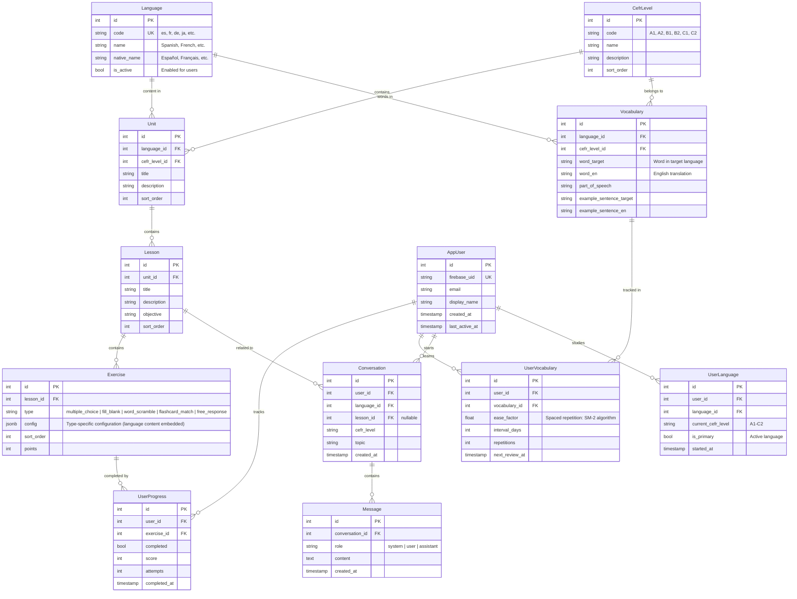

# Langafy Architecture

## 1. Overview

Langafy is a language learning platform featuring CEFR-aligned structured lessons, conversational AI practice, and gamified mini-games. The MVP targets Spanish, but the architecture is designed to support multiple target languages. It is built as a polyglot monorepo targeting web, mobile, and cloud deployment on Google Cloud Platform.

```
┌──────────────┐     ┌──────────────┐
│   Web App    │     │  Mobile App  │
│  (Next.js)   │     │   (Expo)     │
└──────┬───────┘     └──────┬───────┘
       │                    │
       └────────────┬───────┘
                    │ HTTPS / REST
                    ▼
           ┌────────────────┐
           │   API Server   │
           │ (ASP.NET Core) │
           └───────┬────────┘
                   │
       ┌───────────┼───────────┐
       ▼           ▼           ▼
┌────────────┐ ┌───────────┐ ┌──────────────┐
│  Cloud SQL │ │ OpenRouter│ │   Firebase   │
│ PostgreSQL │ │  (LLM AI) │ │     Auth     │
└────────────┘ └───────────┘ └──────────────┘
```

---

## 2. Monorepo Structure

```
langafy/
├── apps/
│   ├── web/                  # Next.js 16, React 19, Tailwind CSS 4
│   ├── mobile/               # Expo 54, React Native 0.81, NativeWind
│   └── api/
│       └── LangafyApi/       # ASP.NET Core 10 Web API
├── packages/
│   ├── shared-types/         # TypeScript types (API contracts, CEFR models)
│   └── shared-game-logic/    # Platform-agnostic React hooks for game state
├── docker/
│   └── docker-compose.yml    # Local development orchestration
├── scripts/
│   ├── bump.js               # Semver version bump (patch/minor/major)
│   └── seed.js               # Database seed utility
├── .github/
│   └── workflows/
│       └── ci.yml            # CI pipeline (lint, test, build, Docker)
├── package.json              # Root — npm workspaces config + monorepo scripts
├── LangafyApi.sln            # .NET solution file
├── ARCHITECTURE.md
└── PLAN.md
```

### Monorepo Tooling: npm Workspaces

**npm workspaces** — not Turborepo, Nx, or Lerna.

**Rationale:** Only two JS/TS apps need coordination; the API is .NET managed separately via `dotnet` CLI. The shared packages (`shared-types`, `shared-game-logic`) require no task caching or remote caching at this scale. npm workspaces are built into npm and provide simple workspace linking with zero additional dependencies.

### Shared Packages

| Package | Purpose |
|---------|---------|
| `@langafy/shared-types` | TypeScript type definitions for all API request/response contracts and CEFR models. Consumed by both web and mobile. |
| `@langafy/shared-game-logic` | Platform-agnostic React hooks for game state (timer, scoring, card flip state machine, scramble generation). Shared between web and mobile to avoid duplicate game logic. |

`shared-game-logic` explicitly does NOT belong in `shared-types` — it has runtime code and a React peer dependency.

---

## 3. Tech Stack

| Layer | Technology | Version | Justification |
|-------|-----------|---------|--------------|
| **Web** | Next.js + React + Tailwind CSS | 16 / 19 / 4 | App Router with React Server Components, latest React features, utility-first CSS |
| **Mobile** | Expo + React Native + NativeWind | 54 / 0.81 / 4.2 | Managed workflow with OTA updates, shared Tailwind mental model with web |
| **API** | ASP.NET Core 10 / C# | net10.0 | Strong typing, high performance, EF Core for data access, demonstrates polyglot skills |
| **Database** | PostgreSQL 16 | 16-alpine | See [Database Design](#4-database-design) |
| **Auth** | Firebase Authentication | SDK 12 | See [Authentication](#5-authentication) |
| **AI** | OpenRouter | — | Provider-agnostic LLM routing via `IConversationAIService`; Claude-quality responses at reduced cost |
| **Logging** | Serilog | 10.0 | Structured JSON logging for Cloud Logging ingestion; correlation IDs; `UseSerilogRequestLogging` |
| **Containerization** | Docker + docker-compose | — | Per-app Dockerfiles, local dev orchestration |
| **Cloud** | GCP Cloud Run | — | Serverless containers, scale-to-zero, pay-per-use |
| **ORM** | Entity Framework Core + Npgsql | 10.0 | Code-first migrations, LINQ queries, PostgreSQL-native features |
| **Shared Types** | `@langafy/shared-types` | — | API contract types consumed by web and mobile |
| **Shared Logic** | `@langafy/shared-game-logic` | — | Game hooks shared between web and mobile |

---

## 4. Database Design

### Why PostgreSQL 16

| Feature | PostgreSQL |
|---------|-----------|
| JSONB support | Native, indexable, rich operators — used for exercise `config` |
| Hierarchical data | `ltree` available for CEFR paths if needed |
| Full-text search | Built-in `tsvector`/`tsquery` for vocabulary search |
| Array columns | Native array types |
| CHECK constraints | Full support |
| Cloud SQL | Fully supported |

### Multi-Language Data Model

The CEFR scale is language-agnostic (A1–C2 applies to any language), so the `CefrLevel` table is shared. Language-specific content is scoped via a `Language` table and `language_id` foreign keys. Adding a new language is an additive operation — new rows in content tables, no schema changes.

```
Language (es, fr, de, ja, ...)
    └──▶ Unit (scoped to language + CEFR level)
           └──▶ Lesson
                  └──▶ Exercise (config contains language-specific content)
    └──▶ Vocabulary (scoped to language + CEFR level)
```

### Schema Design



**Key multi-language design decisions:**

- `UserLanguage` is a join table allowing users to study multiple languages, each with its own CEFR progress level
- `Unit` is scoped to both `language_id` and `cefr_level_id` — the same CEFR level has different units per language
- `Vocabulary` uses generic column names (`word_target`, `word_en`) rather than language-specific ones (`word_es`)
- `Exercise.config` JSONB contains the language-specific content (questions, answers, sentences) — no schema change needed per language
- `Conversation` includes `language_id` so the AI tutor knows which language to practice

### Exercise Config Examples (JSONB)

```json
// multiple_choice
{
  "question": "¿Cómo se dice 'hello' en español?",
  "options": ["Hola", "Adiós", "Gracias", "Por favor"],
  "correct_index": 0
}

// fill_blank
{
  "sentence": "Yo ___ estudiante.",
  "blank_index": 1,
  "correct_answer": "soy",
  "accept_alternatives": ["soy"]
}

// word_scramble
{
  "target_word": "biblioteca",
  "hint": "A place where you borrow books",
  "scrambled": "abibtloice"
}

// flashcard_match
{
  "pairs": [
    { "target": "gato", "en": "cat" },
    { "target": "perro", "en": "dog" },
    { "target": "pájaro", "en": "bird" },
    { "target": "pez", "en": "fish" }
  ]
}
```

### ORM Strategy

**Entity Framework Core 10** with the Npgsql provider, using code-first migrations:

- Entity configurations via `IEntityTypeConfiguration<T>` (Fluent API)
- JSONB columns mapped using Npgsql's native JSONB support
- Database seeding via `DbSeeder` class with structured seed files organized per-language (`SeedData/es/`, `SeedData/fr/`)
- Migrations via `dotnet ef migrations add` / `dotnet ef database update`
- External seed script (`scripts/seed.js`) for re-seeding without restarting the API

---

## 5. Authentication

### Firebase Authentication

Firebase handles user registration, login, and token issuance. The ASP.NET API validates Firebase JWTs using `Microsoft.AspNetCore.Authentication.JwtBearer`. On first login, the client calls `POST /api/auth/sync` to create/update a local `AppUser` record and initialize their `UserLanguage` entry (defaults to Spanish A1 for MVP).

### Auth Flow

```
┌────────┐    ┌──────────┐    ┌─────────┐    ┌──────────┐
│ Client │───▶│ Firebase │───▶│ Get JWT │───▶│ API Call │
│        │    │ Sign In  │    │  Token  │    │ w/ Token │
└────────┘    └──────────┘    └─────────┘    └────┬─────┘
                                                   │
                                                   ▼
                                            ┌──────────┐
                                            │ Validate │
                                            │ JWT via  │
                                            │ JwtBearer│
                                            └────┬─────┘
                                                  │
                                          ┌───────┴───────┐
                                          ▼               ▼
                                    ┌──────────┐   ┌───────────┐
                                    │ Sync to  │   │  Process  │
                                    │ AppUser  │   │  Request  │
                                    └──────────┘   └───────────┘
```

---

## 6. Content Management

### Database-Driven

All lesson content, exercises, vocabulary, and CEFR mappings are stored in PostgreSQL and managed via seed scripts.

```
SeedData/
├── cefr-levels.json          # Shared across all languages
├── languages.json            # Available languages
└── es/                       # Spanish content
    ├── units.json
    ├── lessons.json
    ├── exercises.json
    └── vocabulary.json
```

Adding a new language: create a new directory (e.g., `SeedData/fr/`) with the same file structure — no code changes required.

---

## 7. AI/LLM Integration

### OpenRouter via Swappable Interface

The API uses a clean `IConversationAIService` interface with a DI-registered `OpenRouterConversationService` implementation. Swapping providers requires implementing the interface and changing the DI registration — no business logic changes.

```csharp
public interface IConversationAIService
{
    Task<string> GenerateResponseAsync(
        Conversation conversation,
        string userMessage,
        CancellationToken cancellationToken = default);

    IAsyncEnumerable<string> StreamResponseAsync(
        Conversation conversation,
        string userMessage,
        CancellationToken cancellationToken = default);
}
```

### Streaming (Server-Sent Events)

The `/api/conversations/{id}/messages/stream` endpoint uses Server-Sent Events (SSE) to stream AI response tokens to the client as they arrive. This avoids the 3–5 second loading spinner of the non-streaming endpoint. OpenRouter's streaming API is proxied token-by-token; messages are persisted to the database after the stream completes.

```
Client                   API                   OpenRouter
  │                       │                        │
  │  POST /messages/stream│                        │
  ├──────────────────────▶│                        │
  │                       │  POST /chat/completions│
  │                       │  stream: true          │
  │                       ├───────────────────────▶│
  │  text/event-stream    │                        │
  │◀──────────────────────┤  token chunks          │
  │  data: Hello          │◀───────────────────────┤
  │  data: , how          │                        │
  │  data: are you?       │                        │
  │  data: [DONE]         │                        │
  │                       │  (persist to DB)       │
```

### System Prompt Strategy

Each conversation receives a language/level-aware system prompt:

```
You are a friendly {language} tutor. The student is at CEFR level {level}.

Current lesson topic: {topic}
Key vocabulary: {vocabulary_list}

Guidelines:
- Speak primarily in {language}, with English explanations when confused
- Keep vocabulary and grammar within the {level} range
- Gently correct errors by restating the sentence correctly
- Encourage the student and celebrate progress
```

### Rate Limiting

| Endpoint | Limit | Storage |
|----------|-------|---------|
| `POST /api/conversations` | 10 conversations/day per user | In-memory |
| `POST /api/conversations/{id}/messages` | 30 messages/hour per user | In-memory |

Note: In-memory rate limiting resets on Cloud Run cold starts. For production with scale-to-zero, database-backed or Redis-backed counters would be required.

---

## 8. Logging & Observability

### Serilog Structured Logging

All API logging goes through **Serilog** with `CompactJsonFormatter` output — one JSON object per log line, ready for Cloud Logging ingestion.

**Two-phase initialization:**
1. Bootstrap logger captures startup crashes before the DI container is built
2. Full logger (with configuration, DI sinks, `ReadFrom.Services`) replaces it at runtime

**Correlation IDs:** Every request gets an `X-Correlation-ID` (from header or auto-generated UUID). It is pushed into Serilog's `LogContext` (`AsyncLocal` stack) so all log entries within the request's async chain carry it automatically.

**Request logging:** `app.UseSerilogRequestLogging()` logs one structured entry per request with method, path, status code, and elapsed milliseconds. Status code determines log level:
- 2xx/3xx → Information
- 4xx → Warning
- 5xx or exception → Error

**Log level overrides** (via `appsettings.json`/env vars, no redeployment needed):

| Namespace | Production | Development |
|-----------|-----------|-------------|
| Default | Information | Debug |
| Microsoft.* | Warning | Information |
| Microsoft.Hosting.Lifetime | Information | Information |
| Microsoft.EntityFrameworkCore | Warning | Information (SQL logged) |

---

## 9. Containerization

| App | Containerized? | Base Image | Notes |
|-----|--------------|-----------|-------|
| **API** | Yes | `mcr.microsoft.com/dotnet/aspnet:10.0` | Multi-stage build (SDK → runtime) |
| **Web** | Yes | `node:22-alpine` | Multi-stage build; Next.js `output: "standalone"` |
| **Mobile** | No | N/A | Expo runs natively on dev machines; builds via EAS Build in CI |

### Local Development with docker-compose

```yaml
services:
  db:
    image: postgres:16-alpine
    ports: ["5432:5432"]
    healthcheck: pg_isready

  api:
    build: apps/api/LangafyApi/Dockerfile
    ports: ["5000:5000"]
    env:
      ConnectionStrings__DefaultConnection: Host=db;...
      Firebase__ProjectId: ...
      OpenRouter__ApiKey: ...
      AllowedOrigin: http://localhost:3000

  web:
    build: apps/web/Dockerfile
    ports: ["3000:3000"]
    build_args: NEXT_PUBLIC_FIREBASE_* + NEXT_PUBLIC_API_URL
```

---

## 10. Mini-Games Architecture

### No Game Engine

The mini-games use **native React/React Native with animation libraries** — not PhaserJS or any game engine.

**Rationale:**
- Phaser adds ~90KB gzipped; these are card-flip and drag-drop interactions, not video games
- Phaser has poor React Native integration (requires webview wrapper, breaking code sharing)
- Web uses `framer-motion` for animations; mobile uses `react-native-reanimated` (already installed)
- Code sharing is 70–80% via `@langafy/shared-game-logic` hooks vs. ~5% with Phaser
- Full TypeScript type safety maintained throughout

### Game Types (MVP)

| Game | Mechanic | Exercise Type |
|------|---------|--------------|
| **Flashcard Match** | Grid of cards — tap to flip and match target/English pairs. Timed, with animations. | `flashcard_match` |
| **Word Scramble** | Rearrange shuffled letters to form the correct word. Hint available. | `word_scramble` |
| **Fill-in-the-Blank** | Sentence with missing word(s). Text input or multiple choice variant. | `fill_blank` |

### Shared Game Logic Package

Game state management lives in `@langafy/shared-game-logic` (platform-agnostic React hooks):

- Timer hook (countdown + elapsed)
- Scoring hook (points, time bonus)
- Card flip state machine (unflipped → flipped → matched/mismatched)
- Scramble generation (shuffle, validate, regenerate if unsolvable)

Web and mobile components consume these hooks, contributing only platform-specific rendering and animations.

### Component Architecture

```
ExerciseRenderer
├── MultipleChoice
├── FillInTheBlank        (also a mini-game)
├── WordScramble          (mini-game — uses shared hook)
└── FlashcardMatch        (mini-game — uses shared hook)
```

Each component:
1. Receives exercise `config` as props
2. Manages local game state via shared hooks (timer, attempts, current answer)
3. Renders interactive UI with platform-appropriate animations
4. Submits the answer to the API on completion
5. Displays success/failure feedback

---

## 11. API Design

### Minimal APIs with Vertical Slice Organization

ASP.NET Core Minimal APIs grouped by feature area, not by technical layer:

```
LangafyApi/
├── Features/
│   ├── Auth/
│   │   └── AuthEndpoints.cs
│   ├── Languages/
│   │   └── LanguageEndpoints.cs
│   ├── Lessons/
│   │   ├── LessonEndpoints.cs
│   │   └── LessonDtos.cs
│   ├── Exercises/
│   │   ├── ExerciseEndpoints.cs
│   │   ├── ExerciseDtos.cs
│   │   └── ExerciseValidator.cs
│   ├── Progress/
│   │   ├── ProgressEndpoints.cs
│   │   └── ProgressDtos.cs
│   ├── Conversations/
│   │   ├── ConversationEndpoints.cs
│   │   └── ConversationDtos.cs
│   └── Vocabulary/
│       ├── VocabularyEndpoints.cs
│       └── VocabularyDtos.cs
├── Data/
│   ├── AppDbContext.cs
│   ├── Entities/
│   ├── Migrations/
│   └── SeedData/
│       ├── cefr-levels.json
│       ├── languages.json
│       └── es/
├── Services/
│   ├── IConversationAIService.cs
│   ├── OpenRouterConversationService.cs
│   └── ConversationRateLimitService.cs
├── Prompts/
│   └── SystemPromptTemplate.cs
└── Program.cs
```

### Key Endpoints

| Method | Path | Description | Auth |
|--------|------|-------------|------|
| `POST` | `/api/auth/sync` | Sync Firebase user to local DB | Yes |
| `GET` | `/api/languages` | List available languages | No |
| `GET` | `/api/levels` | List all CEFR levels | No |
| `GET` | `/api/languages/{code}/levels/{id}/units` | Units for a language + CEFR level | No |
| `GET` | `/api/units/{id}/lessons` | Lessons within a unit | No |
| `GET` | `/api/lessons/{id}` | Lesson detail with exercises + user progress | Yes |
| `POST` | `/api/exercises/{id}/submit` | Submit exercise answer | Yes |
| `GET` | `/api/progress` | User progress summary | Yes |
| `GET` | `/api/vocabulary` | User vocabulary bank (paginated) | Yes |
| `GET` | `/api/vocabulary/due` | Vocabulary items due for spaced repetition review | Yes |
| `POST` | `/api/vocabulary/{id}/review` | Record spaced repetition review (SM-2) | Yes |
| `POST` | `/api/conversations` | Start new AI conversation | Yes |
| `POST` | `/api/conversations/{id}/messages` | Send message, get full AI response | Yes |
| `POST` | `/api/conversations/{id}/messages/stream` | Send message, stream AI response (SSE) | Yes |
| `GET` | `/api/conversations/{id}` | Full conversation history | Yes |
| `GET` | `/api/conversations` | List user's conversations (paginated) | Yes |
| `DELETE` | `/api/conversations/{id}` | Delete conversation + messages | Yes |
| `POST` | `/api/user/languages` | Enroll in a language | Yes |
| `PUT` | `/api/user/languages/{code}/primary` | Set active/primary language | Yes |
| `GET` | `/api/health` | Health check (DB connectivity) | No |

### Design Patterns

- **Error handling**: RFC 7807 Problem Details via `Results.Problem()` for all error responses
- **Pagination**: Cursor-based pagination for vocabulary and conversations
- **Request validation**: Data annotations + code-style enforcement (`EnforceCodeStyleInBuild`)
- **Response DTOs**: Dedicated request/response records per endpoint — entities never exposed directly
- **OpenAPI**: Swagger UI with endpoint descriptions, feature-area tags, and auth annotations
- **Caching**: `IMemoryCache` on CEFR levels, languages, and units (5-minute expiry)
- **Startup validation**: Fails fast on missing required config, logging all gaps at once before aborting

---

## 12. CI/CD Pipeline

### GitHub Actions (`.github/workflows/ci.yml`)

```
Concurrently:
┌─────────────────┐   ┌──────────────┐   ┌──────────────┐
│ shared-packages │   │     api      │   │    docker    │
│ (build + test)  │   │ (build+test) │   │ (image build)│
└────────┬────────┘   └──────────────┘   └──────────────┘
         │ artifact                       ┌──────────────┐
         │                                │   security   │
  ┌──────┴──────────┐                     │ (npm audit + │
  │      web        │                     │ dotnet vuln) │
  │ (lint+build+test│                     └──────────────┘
  └─────────────────┘
  ┌─────────────────┐
  │     mobile      │
  │ (lint + test)   │
  └─────────────────┘
```

**Jobs:**
1. **shared-packages** — builds `@langafy/shared-types` and `@langafy/shared-game-logic`, runs Vitest, uploads dist artifacts
2. **api** — .NET 10 build (enforces code style), xUnit tests via Testcontainers.PostgreSql, `dotnet format --verify-no-changes`
3. **web** — downloads shared artifacts, ESLint, Next.js build, Vitest unit tests, Playwright E2E
4. **mobile** — ESLint, Jest unit tests
5. **docker** — builds API and web Docker images (validates Dockerfiles)
6. **security** — `npm audit --audit-level=critical`, `dotnet list package --vulnerable`

**Concurrency:** Cancels in-progress runs on the same branch (no queue buildup on rapid pushes).

**Build order:** `shared-packages` → `web` and `mobile` in parallel (both depend on shared artifacts). `api`, `docker`, and `security` run independently in parallel.

---

## 13. GCP Deployment Architecture

```
                    ┌─────────────────────────────────┐
                    │          Google Cloud            │
                    │                                  │
  HTTPS ──────────▶ │  ┌────────────────────────────┐  │
                    │  │       Cloud Run (Web)       │  │
                    │  │     Next.js Standalone      │  │
                    │  └─────────────┬──────────────┘  │
                    │                │                  │
  HTTPS ──────────▶ │  ┌─────────────▼──────────────┐  │
                    │  │       Cloud Run (API)       │  │
                    │  │     ASP.NET Core 10         │  │
                    │  └─────────────┬──────────────┘  │
                    │                │                  │
                    │       ┌────────┴────────┐        │
                    │       ▼                 ▼        │
                    │  ┌──────────┐   ┌────────────┐   │
                    │  │Cloud SQL │   │  Secret    │   │
                    │  │ Postgres │   │  Manager   │   │
                    │  └──────────┘   └────────────┘   │
                    │                                  │
                    │  ┌──────────────────────────┐    │
                    │  │    Artifact Registry     │    │
                    │  └──────────────────────────┘    │
                    └─────────────────────────────────┘
```

| Service | Details |
|---------|---------|
| **Cloud Run (API)** | Min: 0, Max: 3 instances; 512MB memory; 1 CPU; connects to Cloud SQL via VPC Connector |
| **Cloud Run (Web)** | Min: 0, Max: 3 instances; 256MB memory; 1 CPU; `NEXT_PUBLIC_API_URL` points to API service |
| **Cloud SQL** | PostgreSQL 16; `db-f1-micro`; private IP within VPC; automated daily backups |
| **Secret Manager** | DB connection string, Firebase project ID, OpenRouter API key |
| **Artifact Registry** | Docker repository for API and web images; tagged by git SHA |
| **VPC Connector** | Serverless VPC Access for Cloud Run → Cloud SQL private IP |
| **CI/CD** | GitHub Actions with Workload Identity Federation (keyless auth to GCP) |

**Cost model:** Cloud Run's scale-to-zero means near-zero cost when idle. Primary ongoing cost is Cloud SQL `db-f1-micro` (~$7–10/month).

---

## 14. Architectural Trade-Offs

| Decision | Pros | Cons |
|----------|------|------|
| **Polyglot stack** (TypeScript + C#) | Demonstrates breadth; best tool for each job | Context-switching cost; two build systems |
| **Firebase Auth** | Fast to implement; free tier; managed security | Vendor lock-in; user data split between Firebase and Cloud SQL |
| **Database-driven content** | Single source of truth; full query power | No visual content editor; manual content entry at MVP |
| **Multi-language-ready data model** | Adding languages requires no schema changes | Slightly more complex queries (language filter) |
| **OpenRouter for AI** | Low cost; provider-agnostic interface | Not GCP-native; model quality varies by routing |
| **SSE streaming** | Better UX vs. 3–5s spinner; Cloud Run compatible | Messages persisted only after stream completes (not on disconnect) |
| **Cloud Run** (scale-to-zero) | Near-zero cost when idle; no infra management | Cold starts (1–3s) affect first request |
| **In-memory rate limiting** | Simple, zero infra overhead | Resets on Cloud Run cold starts; not shared across instances |
| **npm workspaces** (not Turborepo) | Zero additional dependencies; simple config | No task caching; manual script orchestration |
| **Shared game logic** (not shared UI) | Minimal monorepo complexity; each platform uses native patterns | Duplicated rendering code; visual inconsistencies possible |
| **No game engine** (Phaser) | Small bundle; native RN support; full TypeScript safety | Requires custom animation code |

---

## 15. Additional Considerations

### Monitoring & Logging

- **Cloud Run**: Built-in metrics (request count, latency, error rate, instance count) in Cloud Monitoring
- **Serilog**: Structured JSON → Cloud Logging. `CompactJsonFormatter` output parsed automatically for severity, labels, trace fields
- **Alerting**: Cloud Monitoring alerts for error rate spikes and Cloud SQL connection failures
- **Correlation IDs**: `X-Correlation-ID` header propagated through all requests, included in every log entry

### Secrets Management

- **Production**: GCP Secret Manager for all secrets (DB connection string, Firebase project ID, OpenRouter API key)
- **Local development**: `.env` files (gitignored) with `.env.example` templates checked in
- **CI/CD**: GitHub Actions secrets or Workload Identity Federation for GCP access
- **Startup validation**: API fails fast if required config is missing, logging all gaps before aborting

### CORS

- **Development**: Allow `http://localhost:3000` (web) and Expo dev server origins
- **Production**: Allow only the production web domain (`AllowedOrigin` env var)
- Configured in `Program.cs` via `AddCors()` with named policies

### Caching

- **In-memory cache**: CEFR levels, units, lessons, and language list cached with `IMemoryCache` (5-minute expiry)
- **HTTP caching**: `Cache-Control` headers on public content endpoints
- **No distributed cache**: Not needed at MVP scale (single Cloud Run instance handles the load)

### Testing Strategy

```
         ┌───────────┐
         │   E2E     │  ← Playwright (web) — login → lesson → exercise flow
         ├───────────┤
         │Integration│  ← WebApplicationFactory + Testcontainers.PostgreSql (API)
         ├───────────┤
         │ Component │  ← React Testing Library (web/mobile)
         ├───────────┤
         │   Unit    │  ← xUnit (API), Vitest (web), Jest (mobile)
         └───────────┘
```

- **API**: xUnit + Testcontainers (real PostgreSQL for integration tests — no mocking)
- **Web**: Vitest + React Testing Library for component/hook tests; Playwright for E2E
- **Mobile**: Jest + React Native Testing Library for component tests
- **shared-game-logic**: Vitest unit tests for game hooks

### Accessibility

- **Web**: Target WCAG 2.1 AA — semantic HTML, ARIA labels, keyboard navigation, color contrast
- **Mobile**: React Native accessibility props (`accessibilityLabel`, `accessibilityRole`, `accessibilityHint`) on all interactive elements

### Security

- Firebase JWT validation on all protected endpoints
- Input validation on all API endpoints (prevent injection)
- Sanitize AI conversation inputs (prevent prompt injection)
- Security headers on web app (CSP, X-Frame-Options, etc.)
- Dependency auditing in CI via `npm audit` and `dotnet list package --vulnerable`
- HTTPS enforced in production (Cloud Run provides this automatically)
- API startup validates all required configuration before accepting traffic

### Versioning

The monorepo uses **lockstep versioning** — all packages share a single version number tracked in the root `package.json`. The bump script (`scripts/bump.js`) updates all `package.json` files and the `.csproj <Version>` element atomically.

```bash
npm run bump:patch   # 0.1.0 → 0.1.1
npm run bump:minor   # 0.1.0 → 0.2.0
npm run bump:major   # 0.1.0 → 1.0.0
```

### Internationalization (i18n) vs Multi-Language Content

Two separate concerns:

- **Content languages**: Target languages users are learning (Spanish, French, etc.) — handled by the `Language` table and language-scoped content
- **UI language / i18n**: Language of the app interface (buttons, labels, navigation) — currently English-only. Adding i18n (`next-intl` for web, `i18next` for mobile) is a future consideration, not MVP scope.
