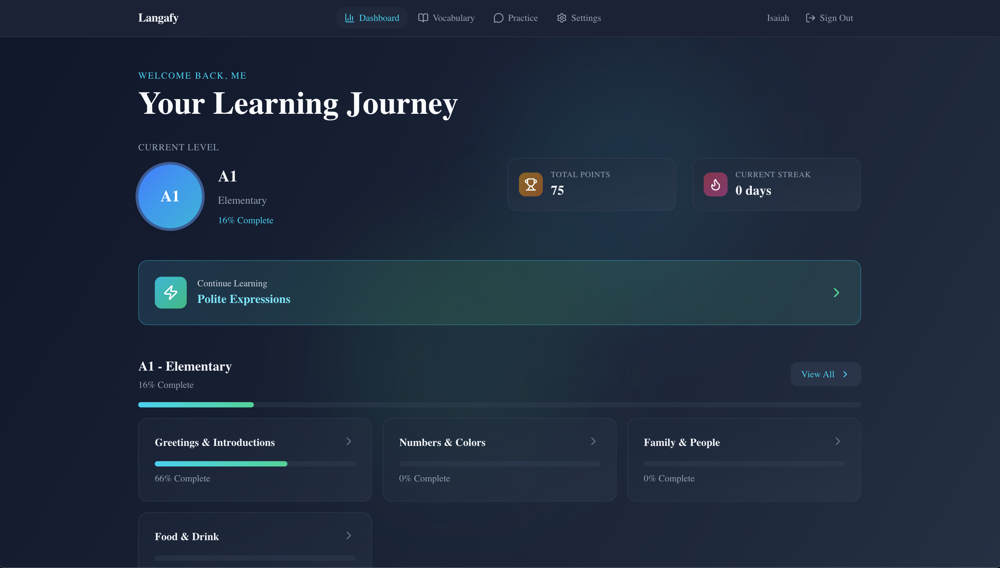
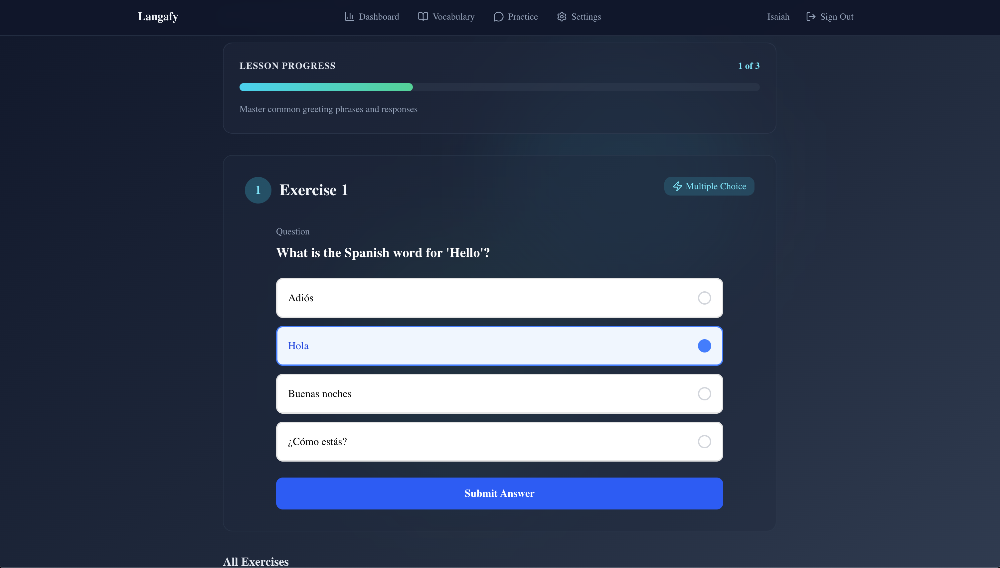

# Langafy

A language learning platform with CEFR-aligned lessons, conversational AI practice, and mini-games. The MVP targets Spanish, but the architecture supports multiple target languages across web, mobile, and cloud deployment.

## Screenshots





## What's Built

| Feature                                                   | Web | Mobile |
| --------------------------------------------------------- | --- | ------ |
| Firebase authentication (email + Google)                  | ✓   | ✓      |
| CEFR-aligned content (A1–C2, units → lessons → exercises) | ✓   | ✓      |
| Multiple choice exercises                                 | ✓   | ✓      |
| Fill-in-the-blank exercises                               | ✓   | ✓      |
| Word scramble mini-game                                   | ✓   | ✓      |
| Flashcard matching mini-game                              | ✓   | ✓      |
| Progress tracking (per-exercise, lesson, unit, level)     | ✓   | ✓      |
| AI conversation practice (streaming + non-streaming)      | ✓   | ✓      |
| Voice input for conversation (speech recognition)         | —   | ✓      |
| Text-to-speech pronunciation                              | —   | ✓      |
| Vocabulary bank with spaced repetition (SM-2)             | ✓   | ✓      |

## Prerequisites

- **Node.js 22+** and **npm 10+**
- **.NET 10 SDK**
- **Docker** and **Docker Compose**
- **Expo CLI** (optional, for mobile development): `npm install -g expo-cli`

## Getting Started

### 1. Install dependencies

```bash
git clone https://github.com/ijshd7/langafy
cd langafy
npm install
```

### 2. Configure environment

```bash
cp .env.example .env
```

Edit `.env` with your credentials. The defaults work for local development except for Firebase keys and the OpenRouter API key, which you must supply:

```env
# PostgreSQL — defaults work as-is
POSTGRES_USER=langafy
POSTGRES_PASSWORD=langafy_dev
POSTGRES_DB=langafy

# Firebase — required
FIREBASE_PROJECT_ID=your-firebase-project-id
NEXT_PUBLIC_FIREBASE_API_KEY=your-firebase-api-key
# ... (see .env.example for full list)

# OpenRouter — required for AI conversations
OPENROUTER_API_KEY=your-openrouter-api-key
```

### 3. Start the stack

```bash
npm run docker:up
```

This starts:

- **PostgreSQL** on port `5432`
- **API** on `http://localhost:5000` (Swagger UI at `/swagger`)
- **Web app** on `http://localhost:3000`

To stop:

```bash
npm run docker:down
```

### Running services individually

**Terminal 1 — Database:**

```bash
docker run -d --name langafy-db \
  -e POSTGRES_USER=langafy \
  -e POSTGRES_PASSWORD=langafy_dev \
  -e POSTGRES_DB=langafy \
  -p 5432:5432 \
  postgres:16-alpine
```

**Terminal 2 — API:**

```bash
npm run dev:api
```

**Terminal 3 — Web:**

```bash
npm run dev:web
```

**Terminal 4 — Mobile (optional):**

```bash
npm run dev:mobile         # Expo dev server (scan QR with Expo Go)
npx expo start --web       # Run in browser
```

For physical device testing, update `EXPO_PUBLIC_API_URL` in `apps/mobile/.env.local` to your machine's LAN IP.

## Project Structure

```
langafy/
├── apps/
│   ├── web/                    # Next.js 16 + React 19 + Tailwind CSS 4
│   │   └── src/
│   │       ├── app/            # App Router pages
│   │       │   ├── (auth)/     # Login, signup
│   │       │   └── (main)/     # Dashboard, levels, lessons, practice, vocabulary
│   │       ├── components/
│   │       │   ├── exercises/  # MultipleChoice, FillInTheBlank, ExerciseRenderer
│   │       │   └── games/      # FlashcardMatch, WordScramble
│   │       └── lib/            # API client, Firebase setup
│   ├── mobile/                 # Expo 54 + React Native 0.81 + NativeWind
│   │   └── app/
│   │       ├── (auth)/         # Login, signup screens
│   │       ├── (tabs)/         # Home, Learn, Practice, Profile tabs
│   │       └── lessons/        # Lesson detail with exercises
│   └── api/
│       └── LangafyApi/         # ASP.NET Core 10 Web API
│           ├── Features/       # Auth, Languages, Lessons, Exercises, Progress,
│           │                   # Conversations, Vocabulary
│           ├── Data/           # EF Core context, entities, migrations, seed data
│           ├── Services/       # IConversationAIService, OpenRouterConversationService
│           └── Program.cs
├── packages/
│   ├── shared-types/           # @langafy/shared-types — API contract types
│   └── shared-game-logic/      # @langafy/shared-game-logic — game state hooks
├── docker/
│   └── docker-compose.yml
├── scripts/
│   ├── bump.js                 # Semver version bump
│   └── seed.js                 # Database seeding utility
└── .github/
    └── workflows/
        └── ci.yml              # CI pipeline
```

## Environment Variables

### Root `.env` (consumed by docker-compose)

| Variable                 | Required                              | Description                                   |
| ------------------------ | ------------------------------------- | --------------------------------------------- |
| `POSTGRES_USER`          | No (default: `langafy`)               | PostgreSQL username                           |
| `POSTGRES_PASSWORD`      | No (default: `langafy_dev`)           | PostgreSQL password                           |
| `POSTGRES_DB`            | No (default: `langafy`)               | PostgreSQL database name                      |
| `FIREBASE_PROJECT_ID`    | Yes                                   | Firebase project ID for API JWT validation    |
| `OPENROUTER_API_KEY`     | Yes                                   | OpenRouter API key for AI conversations       |
| `ALLOWED_ORIGIN`         | No (default: `http://localhost:3000`) | CORS origin for production                    |
| `NEXT_PUBLIC_FIREBASE_*` | Yes                                   | Firebase public keys baked into the web build |
| `NEXT_PUBLIC_API_URL`    | No (default: `http://localhost:5000`) | API URL for the web app                       |

Copy `.env.example` for the full list with descriptions.

### Web `apps/web/.env.local`

Copy `apps/web/.env.example`. All `NEXT_PUBLIC_*` vars are baked into the Next.js build at compile time.

### Mobile `apps/mobile/.env.local`

Copy `apps/mobile/.env.example`. `EXPO_PUBLIC_*` vars are injected into `Constants.expoConfig.extra` via `app.config.ts`.

## Scripts

### Development

| Script               | Description                                 |
| -------------------- | ------------------------------------------- |
| `npm run dev:web`    | Start Next.js dev server (`localhost:3000`) |
| `npm run dev:mobile` | Start Expo dev server                       |
| `npm run dev:api`    | Start .NET API (`localhost:5000`)           |

### Docker

| Script                   | Description                       |
| ------------------------ | --------------------------------- |
| `npm run docker:up`      | Start all services (db, api, web) |
| `npm run docker:rebuild` | Rebuild images and start          |
| `npm run docker:down`    | Stop all services                 |

### Database

| Script               | Description                            |
| -------------------- | -------------------------------------- |
| `npm run seed`       | Seed the database with Spanish content |
| `npm run seed:reset` | Drop and re-seed the database          |
| `npm run seed:help`  | Show seed script options               |

### Quality

| Script                 | Description                                                 |
| ---------------------- | ----------------------------------------------------------- |
| `npm run lint`         | ESLint (web + mobile) + `dotnet format --verify-no-changes` |
| `npm run format`       | Prettier format all files                                   |
| `npm run format:check` | Verify formatting without writing                           |

### Versioning

| Script               | Description                          |
| -------------------- | ------------------------------------ |
| `npm run bump:patch` | `0.1.0` → `0.1.1` — bug fixes        |
| `npm run bump:minor` | `0.1.0` → `0.2.0` — new features     |
| `npm run bump:major` | `0.1.0` → `1.0.0` — breaking changes |

The bump script updates all `package.json` files and the `.csproj <Version>` element atomically (lockstep versioning). After bumping:

```bash
git add package.json apps/*/package.json packages/*/package.json \
      apps/api/LangafyApi/LangafyApi.csproj
git commit -m "chore: bump version to X.Y.Z"
git tag vX.Y.Z
```

## Technology Stack

| Layer                 | Technology                       | Version         |
| --------------------- | -------------------------------- | --------------- |
| **Web**               | Next.js + React + Tailwind CSS   | 16 / 19 / 4     |
| **Web animations**    | framer-motion                    | 12              |
| **Mobile**            | Expo + React Native + NativeWind | 54 / 0.81 / 4.2 |
| **Mobile animations** | react-native-reanimated          | 4.1             |
| **API**               | ASP.NET Core / C#                | net10.0         |
| **Database**          | PostgreSQL                       | 16              |
| **Auth**              | Firebase Authentication          | SDK 12          |
| **AI**                | OpenRouter                       | —               |
| **Logging**           | Serilog                          | 10.0            |
| **Containerization**  | Docker + docker-compose          | —               |
| **Shared types**      | `@langafy/shared-types`          | —               |
| **Shared game logic** | `@langafy/shared-game-logic`     | —               |

See [ARCHITECTURE.md](ARCHITECTURE.md) for the full technical design, trade-off analysis, and GCP deployment architecture.

## API

Swagger UI is available at `http://localhost:5000/swagger` when the API is running.

Key endpoint groups:

- `POST /api/auth/sync` — sync Firebase user to the database
- `GET /api/languages/{code}/levels/{levelId}/units` — content navigation
- `GET /api/lessons/{id}` — lesson detail with exercises and user progress
- `POST /api/exercises/{id}/submit` — submit an exercise answer
- `GET /api/progress` — user progress summary with streaks and completion %
- `POST /api/conversations/{id}/messages/stream` — streaming AI conversation (SSE)
- `GET /api/vocabulary` / `POST /api/vocabulary/{id}/review` — vocabulary bank + spaced repetition

## CI/CD

GitHub Actions runs on every push and pull request:

1. **shared-packages** — build and test `@langafy/shared-types` and `@langafy/shared-game-logic`
2. **api** — .NET build with code style enforcement, xUnit tests (Testcontainers.PostgreSql), format check
3. **web** — ESLint, Next.js build, Vitest unit tests, Playwright E2E
4. **mobile** — ESLint, Jest unit tests
5. **docker** — validate API and web Docker image builds
6. **security** — `npm audit --audit-level=critical`, `dotnet list package --vulnerable`

## License

This project is licensed under the MIT License — see the [LICENSE](LICENSE) file for details.
